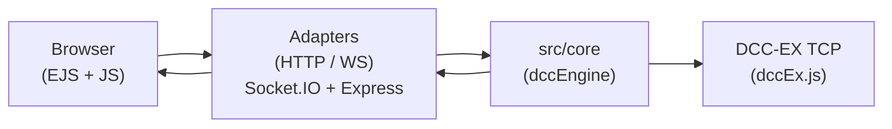

# new-dcc-controller

Web UI and Socket.IO bridge for controlling a **DCC-EX** command station over TCP. The server keeps a **long-running connection** to the layout: it starts when the process starts, not when a browser tab opens.

## Quick start

```bash
npm install
npm run start
```

- App entry: `node src/index.js` (see `package.json` `main` / `start`).
- Default HTTP port: `3000` (override with `PORT`).
- DCC-EX connection: `DCCHost` (default `localhost`), `DCCPort` (default `2560`).

Optional:

- `DEV_LIVE_RELOAD=1` — reload the page when the Socket.IO connection reconnects (dev helper).

Build Tailwind CSS before or alongside dev:

- `npm run build:css` — one-off build to `public/css/tailwind.css`
- `npm run dev:css` — watch mode

## Architecture (how to read this repo)

Single process, one main layout:

```
src/
├── index.js              # process entry: listen on PORT
├── app.js                # composition root: boot core → wire adapters
├── core/                 # always-on domain engine (no HTTP/WS specifics)
├── adapters/
│   ├── http/             # Express routers (HTTP API + HTML pages)
│   └── ws/               # Socket.IO ↔ domain bridge
├── ui/                   # EJS templates only (views root for Express)
├── services/             # infrastructure helpers used by core/adapters
│   ├── dccEx.js          # TCP client to DCC-EX (commands, parsing, state cache)
│   ├── rollingStock.js   # rolling stock data (filesystem-backed)
│   └── dataLayer.js      # data dirs bootstrap
└── socketio.js           # Socket.IO server wrapper
public/                   # static assets (CSS built from src/styles)
```

### Folder roles

| Path | Role |
|------|------|
| **`src/core/`** | **Always-on domain engine.** Today this is mainly `dccEngine.js`: wraps the DCC client, applies startup cab list from rolling stock, exposes commands/status and re-emits domain events. Stays free of Express/Socket.IO imports. |
| **`src/adapters/http/`** | **Express:** HTTP routes and `res.render()` using EJS. Files like `createWebRouter.js` / `createApiRouter.js` build routers from injected dependencies. |
| **`src/adapters/ws/`** | **Socket.IO:** maps browser events (`dcc:*`) to the engine and broadcasts engine events to clients (`setupDccWsAdapter.js`). Keeps WebSocket glue out of `core/`. |
| **`src/ui/`** | **Templates and presentation only** (EJS). Express `views` path points here. Some templates include inline `<script>` for the control panel. **`src/pages/` is not used** — UI lives under `src/ui/`. |
| **`src/app.js`** | **Startup composition:** create Express app, HTTP server, Socket.IO, construct and **start** the core engine **before** attaching adapters, then mount HTTP + WS. |

### Mental model



## What the app does (function list)

- **Power** — track power on/off; status reflected over Socket.IO.
- **Throttle** — set speed/direction per cab; emergency stop control path via UI.
- **Functions** — toggle loco functions; UI syncs with roster selection where implemented.
- **Rolling stock** — read/write train (and wagon) metadata under `data/rollingstock/`; pages under `/rollingstock`.
- **Raw DCC-EX** — “test” panel to send raw commands and see replies over the socket.
- **Realtime** — Socket.IO events for connection state, power, throttle, functions, and raw messages.

This README describes **what exists and how the repo is laid out**. It does **not** maintain a product backlog; track work wherever you prefer (issues, notes, etc.).

## FAQ (from earlier design notes)

- **`src/core/` only has `dccEngine` — is that right?**  
  Yes, for now. It is the domain shell around the DCC client; add more core modules when you introduce non-trivial rules or state that should not live in adapters.

- **`src/ui/` vs `src/pages/`**  
  Templates live in **`src/ui/`** only. `app.js` sets `views` to `src/ui`. There is no parallel `src/pages` tree in the current layout.

- **Adapters**  
  HTTP and WS adapters are intentionally small: they translate HTTP/Socket.IO to engine calls and broadcast engine events outward.

- **`src/app.js`**  
  This is the single composition root: boot order is **core first**, then wire adapters.

## License

See `package.json` (`license` field).
